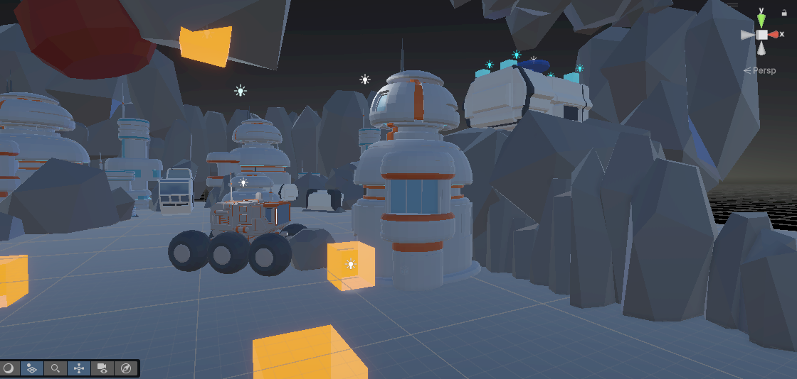
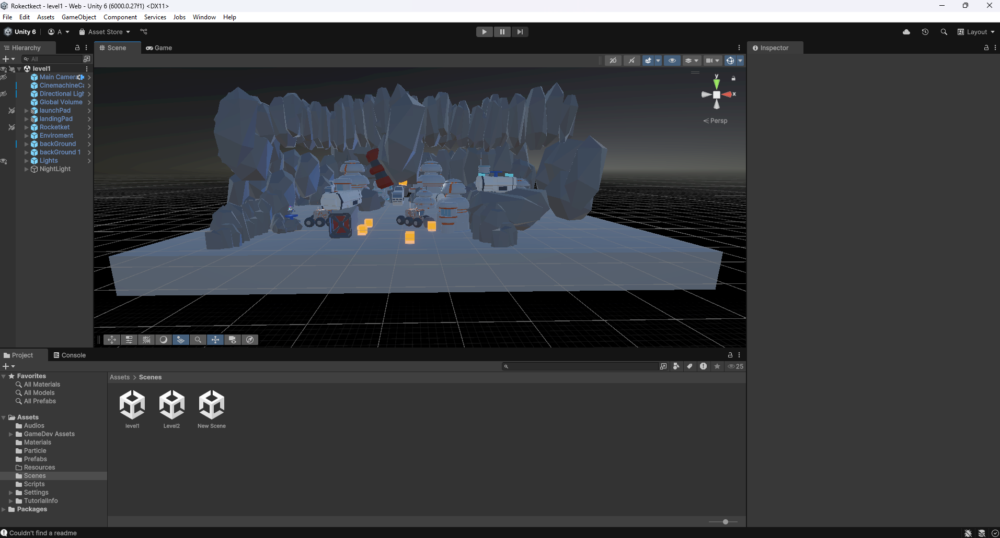
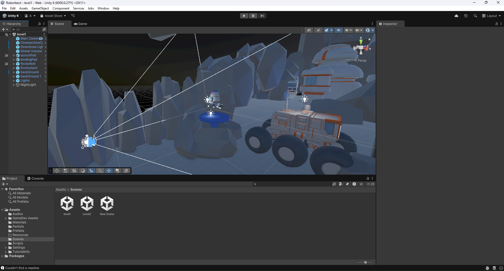
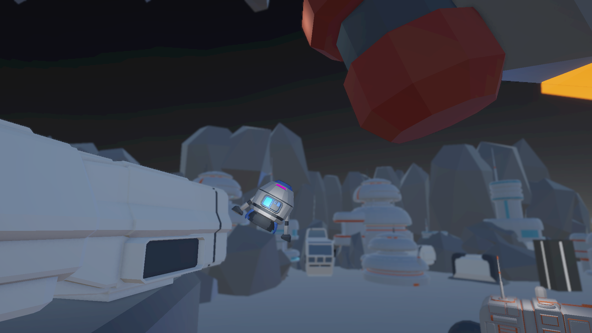

# Rocket Landing Game (3D Unity Project)

A 3D rocket landing simulation game built with Unity. The player controls a small rocket and attempts to land it safely on various platforms across challenging alien terrains. This project focuses on physics-based movement, smooth camera transitions, and stylized low-poly art.

## Gameplay Overview

- Control a rocket using thrust and directional movement.
- Land on pads to complete levels.
- Navigate obstacles like rocks, mechanical arms, and tricky terrain.
- Realistic gravity and momentum-based gameplay.

### Platform 

### Camera 

###

## Features

- 🚀 Physics-based rocket movement
- 🎯 Landing pad detection
- 🎥 Cinemachine-based camera system
- 🌌 Stylized low-poly space environment
- 🌕 Multiple levels (level1, level2)
- 🎮 Player feedback through particles, lighting, and sound

## Controls
| Key/Button    | Action                    |
| ------------- | ------------------------- |
|  `Up`         | Thrust Up (Lift rocket)   |
| `Left`        | Rotate Left               |
| `Right`       | Rotate Right              |
| `R`           | Restart level             |
| `Esc`         | Exit Game                 |

## Tech Stack

- Unity 6000.0.27F1.3 LTS
- C#
- Blender (for 3D models)
- Cinemachine
- Unity Particle System

